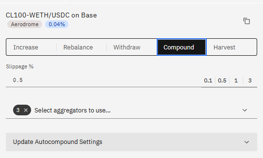

# Automatic Compound

Auto-Compound automatically compounds your positions at the optimal frequency.

This is calculated using a formula that takes in the position size, the APR and the current gas cost.

There is a 1.8% auto-compound fee on rewards, part of which is used to pay for gas costs (no further user input needed).

The setting can be enabled in two places: 

Firstly in the general settings (gear icon on the top right).

Secondly in the Compound tab of any active position.

It is enabled once per chain and applies to all positions on that chain. 

The general setting of Automation needs to be enabled as well, so this requires two transactions:
a) Enable Automation
b) Enable Auto-Compound

These can then be disabled in the general settings.

Auto-Compound and Auto-Harvest are mutually exclusive, only one per chain can be enabled.