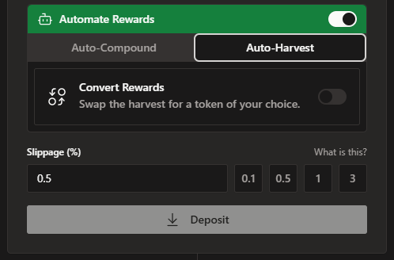
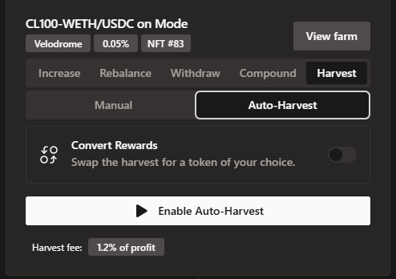
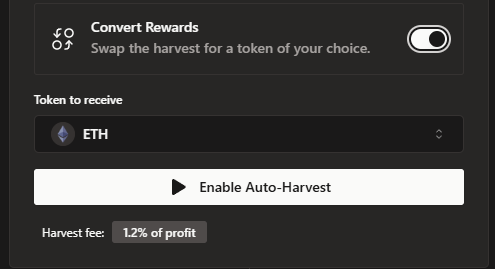

# Automatic Harvest

Auto-Harvest automatically harvests your positions, currently each time the rewards are above the equivalent of $50.

There is a 1.2% auto-harvest fee on rewards, part of which is used to pay for gas costs (no further user input needed).

The setting can be enabled in two places: 

Firstly when opening a new position.

Secondly in the Harvest tab of any active position.

You also have the option of converting the rewards to a token of your choice.

It is enabled individually for each position. 

The general setting of Automation needs to be enabled as well, so this requires two transactions:
a) Enable Automation
b) Enable Auto-Harvest

These can then be disabled in the general settings.

Auto-Harvest and Auto-Compound are mutually exclusive, only one per each position can be enabled.
