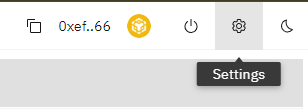

# Automatic Harvest

Auto-Harvest automatically harvests your positions up to once per day, with the minimum earnings currently set to the equivalent of $50.

There is a 1.2% auto-harvest fee on rewards, part of which is used to pay for gas costs (no further user input needed).

The setting can be enabled in two places: 

Firstly in the general settings (gear icon on the top right).

Secondly in the Harvest tab of any active position.

It is enabled once per chain and applies to all positions on that chain. 

The general setting of Automation needs to be enabled as well, so this requires two transactions:
a) Enable Automation
b) Enable Auto-Harvest

These can then be disabled in the general settings.

Auto-Harvest and Auto-Compound are mutually exclusive, only one per chain can be enabled.