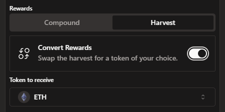
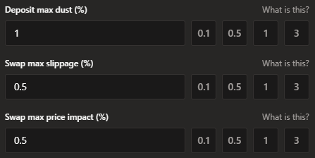
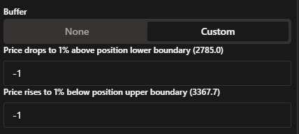
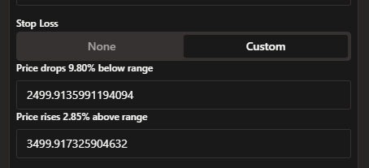

# Automatic Rebalance

When a concentrated liquidity (CL) position is out of range, it needs rebalancing. This is done by withdrawing the single token in the position (since out-of-range positions are only comprised of one token), swapping an appropriate amount of it for the other token, and then creating a new CL position in-range.

Auto-Rebalance does this by monitoring all out-of-range positions in a loop. When one is found, we retrieve quotes for swaps from all supported aggregators, then simulate the transaction using the best one. If it results in less dust (leftover tokens), slippage and price impact than the user has specified, the rebalance takes place, otherwise the attempt is repeated in the next loop.

Auto-Rebalance does not take place if the protocol fees would be less than the gas cost. Depending on the chain this could mean the position needs to be larger than $1,000 (L2s) or $10,000 (Ethereum).

The new position will use the same width as the previous one, and it will maintain its ratio of tick spaces below to tick spaces above. For example a -1% +3% width position (-100 ticks, +300 ticks from active tick space), will remain -1% +3% after rebalancing.

Auto-Rebalance will automatically be activated for the new position as well, using the same settings as the last position.

Enabling Auto-Rebalance can be done in two places.

1) When Opening a new position

    

2) in the Rebalance tab in an active CL position (whether in range or not).

    

## Required Configuration

### Rewards

There are two ways to handle the rewards that a position has accumulated before it went out of range, they can be either compounded back into the position or harvested out to the user's wallet. Optionally when harvesting it can be converted to a different token. The fee charged is 1.8% of rewards. 

### Dust - Slippage - Price Impact

### Dust

When rebalancing, the best effort is made to use the same amount of each token as the previous position. However due to slippage and rounding errors this is not always possible. The difference is the dust. Dust is not lost, it is sent back to the user's wallet at the end of the rebalance. In order to avoid dwindling position sizes, you can choose a maximum % of dust allowed, the default being 1%. If the dust is higher than that, the rebalance will fail and be tried again in the next loop.

### Slippage

Slippage is the % difference between the expected price and the price at the time of the swap. For example if the expected price is 3000 and the price at the time of the swap is 3015, the slippage is 0.5%. This happens when the price of the asset moves between the time the quote is generated and the time the swap is executed. If the price moves more than the slippage value, the rebalance will fail and be tried again in the next loop.

### Price Impact

Price impact is the % difference in price between the asset being sold and the asset being bought. This is estimated by the aggregator used for the swap. If the price impact is higher than the value set, the rebalance will fail and be tried again in the next loop.

## Advanced Configuration

Further to the above there are two advanced configuration options. These are optional, and they are used to create a custom range in which Auto-Rebalance should take place. The default setting, when not using advanced configuration, is to always attempt to rebalance when the position is out of range.

### Buffer

This adds a buffer on either side of the position range, in which rebalancing should not take place. For example if a user's position is in the 3000-3300 range, a buffer of 1% on the lower side will mean that rebalance will not take place when the price is between 2970 and 3000. While the price is in that buffer the position will remain as is.

Similarly in that example a buffer of 1% on the upper side will mean that rebalance will not take place between 3300 and 3333.

Buffer settings are relative, so a buffer of 1%, 1% will remain so when a position is rebalanced (1% below the new lower end, 1% above the new upper end).

Negative buffers are also allowed.

A buffer of -1% on the lower side in the example above would mean that the rebalance would not take place when the price is between 3030 and 3300, but it will take place when the price is below 3030, while the position might still be in range.

Similarly a buffer of -1% on the upper side would mean that the rebalance would not take place when the price is between 3000 and 3267, but it will take place when the price is above 3267, while the position might still be in range.

### Stop Loss

Stop loss indicates fixed prices, below or above which rebalance stops taking place. Continuing the previous example, a stop loss value of 2700 on the lower side will mean that automatic rebalancing will stop completely if the price drops below 2700.

The same mechanism on the upper side if setting a stop loss of 3600 would disable all automatic rebalancing once the price goes above 3600.

Stop loss settings are absolute, so a stop loss setting of 2700, 3600 will remain the same when a position is rebalanced.

Stop loss values are defined in tick prices, so e.g. when entering 2500 it might be converted to the nearest available tick (see screenshot).

The position remains as is, stop loss does not trigger an exit.

### Advanced Settings Example

Putting all advanced settings together, for the example position of 3000-3300, creates two ranges on either side of the user's position where automatic rebalance will take place:

- 2700-2970 and 3333-3600

As well as four ranges where automatic rebalance will not take place:

- 0-2700
- 2970-3000
- 3300-3333
- 3600-infinite

The advanced settings are entirely optional; the default behaviour when not setting a buffer and stop loss would be to rebalance whenever the position is out of range.
