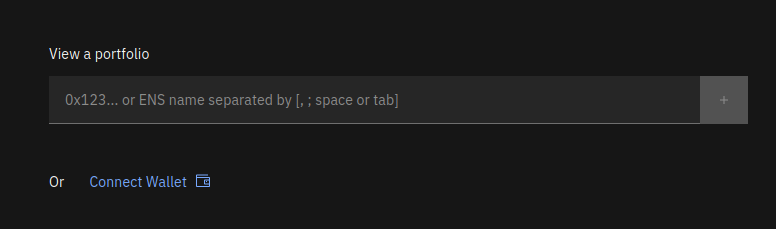

# vfat.io Documentation

 

[vfat.io](https://vfat.io) is a portfolio management app

- You can view your positions for multiple wallets across all EVM chains

- You can interact with them (Stake / Unstake / Claim / etc)

- You can find new opportunities in our [Yield page](https://vfat.io/yield)

 

To get started, head over to [vfat.io](https://vfat.io) and either Connect your wallet, or enter an address or ENS name:

