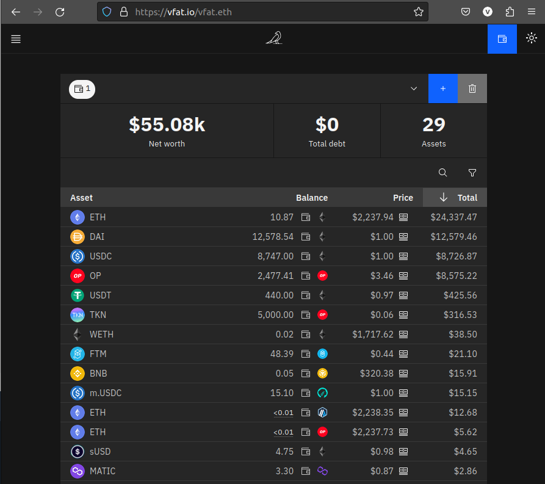
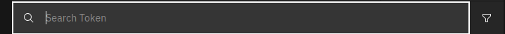
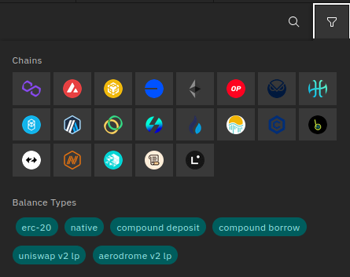
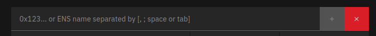
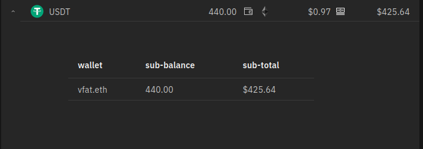
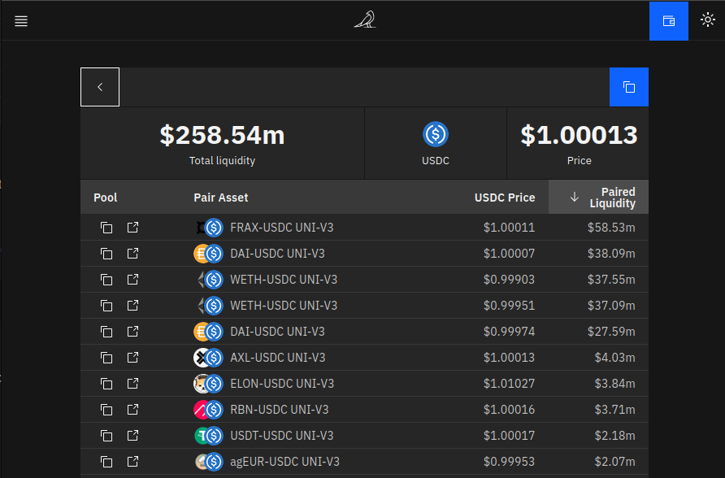

# Portfolio view

After connecting your wallet, or entering a 0x address or ENS name, you are shown that wallet's positions on all chains. You can see the balance, current price and $ total for each position.

You can search for a specific token:

And filter by chain or balance type:

You can add multiple addresses using the add button:

When viewing multiple wallets, you can see a breakdown of which wallet holds which asset by expanding the asset row:

Clicking on the link next to a token price brings up the liquidity page, for example [Mainnet USDC](https://vfat.io/token/1/0xa0b86991c6218b36c1d19d4a2e9eb0ce3606eb48)

