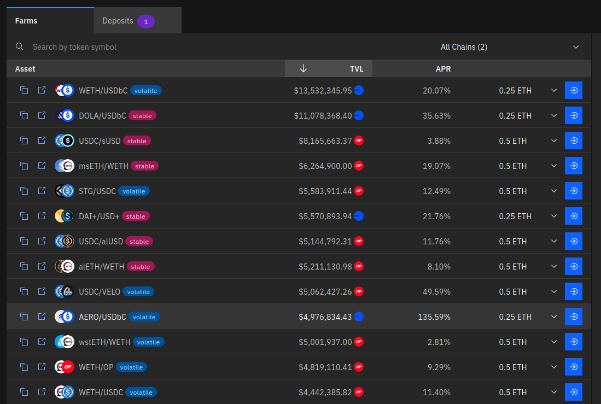
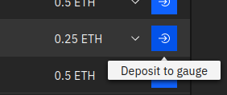
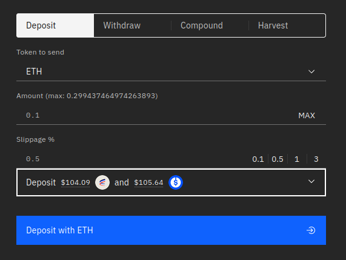
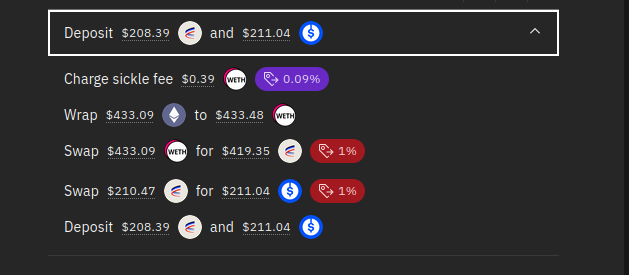
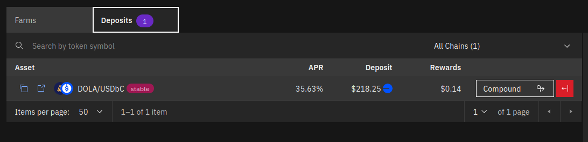
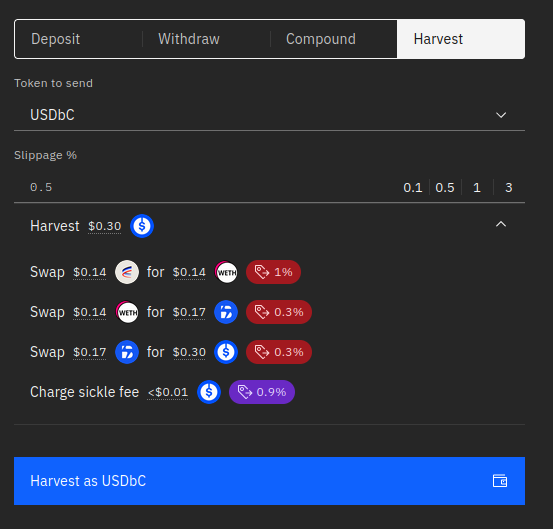

# Yield View

Compare yield products across DeFi, enter and exit positions, compound your earnings in 1 click. All from one interface.

vfat.io lets you choose from a plethora of DeFi products, and offers intuitive and seamless interaction. No more convoluted series of transactions such as swapping, adding liquidity and staking needed to start earning yield. No more having to use 3 or 4 websites and getting a PhD in invariants to accomplish the above. Simply choose the pool you want and click Deposit.

At launch two projects are supported, [Velodrome](https://velodrome.finance/) on Optimism and [Aerodrome](https://aerodrome.finance/) on Base.

Each pool in these projects is comprised of two tokens, and can be either stable (token prices should be similar) or volatile (all other pools). The total value locked (TVL), chain, and APR are shown for each pool.

After connecting your wallet and choosing a pool you want to enter, you can do so in one click by using the Deposit button at the end of the row. There is a pre-selected amount of ETH to quick deposit, which can be adjusted by the drop-down menu:

Alternatively by clicking anywhere on a pool row, it is loaded into the action menu:

There you can enter a custom ETH amount to deposit, or choose a different token to deposit with. Select your preferred slippage, and view the route taken by expanding the Deposit details box.

After depositing, you can also view your position in the Deposits tab at the top:

The quick actions on the right allow you to Compound your earnings, or Exit back to ETH. Selecting the row brings up more options such as withdrawing to a different token, or harvesting any earnings and optionally converting them to ETH or a different token.

### Contract Infrastructure

[vfat.io Yield](https://vfat.io/yield) is powered by Sickle, a self-custodied contract that is deployed on each chain when making your first deposit. Sickle can perform complex actions in a single transaction, as defined in Strategy contracts, such as the inaugural Aerodrome Strategy.

Contracts have been audited by [yAudit](https://reports.yaudit.dev/reports/10-2023-Sickle-Update/). Please note smart contracts bear risk regardless of audits, and there is always the underlying risk of the pool entered.

### Fee Structure

Sickle charges 9 basis points (0.09%) on deposits and withdrawals, and 90 bps (0.9%) on compounds and harvests.
